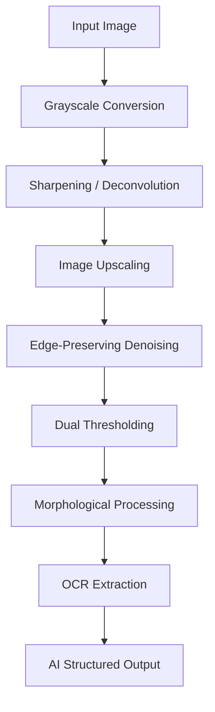

## Pipeline Flow

### Detailed Processing Steps

1.  **Grayscale Conversion**: Reduces the image to a single luminance channel, removing color noise and increasing processing speed.
2.  **Sharpening (Deconvolution-like Filtering)**: Uses a Laplacian kernel to re-emphasize edges that may have been lost due to lens blur or motion.
3.  **Image Upscaling**: Applies Cubic Interpolation to double the image dimensions, providing more pixels for Tesseract to analyze faint character features.
4.  **Edge-Preserving Denoising (Bilateral Filter)**: Smooths out scanner grain and sensor noise without blurring the sharp boundaries of the text.
5.  **Dual Thresholding**: 
    *   **Adaptive Gaussian**: Locally calculates thresholds to handle shadows on crumpled or curved paper.
    *   **Otsu's Method**: Automatically finds the optimal global threshold for binarization.
6.  **Morphological Processing**: Removes small "salt and pepper" noise artifacts through opening operations.
7.  **OCR Extraction**: High-accuracy text recognition using Pytesseract on the optimized binary image.
8.  **AI Structured Output**: Final parsing and validation via Gemini 2.5 Flash, outputting a validated Pandas DataFrame.

## Key Technical Points

### 1. Advanced Deblurring
The "Deconvolution-like" step is critical for real-world document photos which often suffer from lens blur or slight motion. By amplifying the high-frequency components of the image, we "re-focus" the text before OCR begins.

### 2. Context-Aware AI Parsing
Once the raw text is extracted, it is passed to **Google Gemini 2.5 Flash** with a specialized System Instruction. The AI doesn't just "read"—it **validates**. For example:
*   It calculates the sum of service line charges to verify the "Total Charges" box.
*   It interprets tick marks (Y/N) into boolean values for the "Accept Assignment" field.

### 3. Structured Data Output
The final output is converted into a **Pandas DataFrame**. This allows for:
*   Standardized tabular representation in logs.
*   Easy export to CSV or Excel for batch processing.
*   Seamless integration into larger data pipelines.

## Current Limitations

*   Not true mathematical deconvolution
*   No skew or perspective correction
*   No deep-learning-based enhancement
*   Uses heuristic-based OCR result selection

## Possible Improvements

*   Add CLAHE for local contrast enhancement
*   Implement document skew correction
*   Apply advanced deconvolution methods (Wiener, Richardson–Lucy)
*   Tune Tesseract configuration modes
*   Add automatic text region detection
