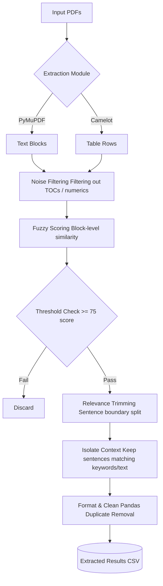

# Contract Pipeline

An automated intelligence pipeline to extract and isolate specific terminologies from documents.

## Pipeline Design

The system follows a multi-stage funnel architecture that ingests raw documents and narrows them down into highly specific extracted clauses.

## Features

- **Multi-modal Extraction**: Extracts unstructured text paragraphs via `PyMuPDF` (`fitz`) and structured tabular data using `camelot`.
- **Fuzzy Matching Strategy**: Employs `rapidfuzz` string similarity logic to cross-reference extracted content against predefined target texts and keywords based on fuzzy token thresholds.
- **Intelligent Noise Filtering & Trimming**:
  - Excludes standard noise (TOCs, numeric heavy garbage, etc.).
  - Evaluates matching blocks sentence-by-sentence to trim irrelevant context, ensuring the output strictly adheres to the core extracted requirement.
- **Duplicate Removal & Formatting**: Utilizes `pandas` to clean, normalize, sort, and format the final extracted matches.

## Configuration

You can tweak the variables directly inside `main.py` to change the thresholds and targets:

- `TARGET_KEYWORDS`: List of keywords signifying the core required language.
- `TARGET_TEXT`: The main paragraph/sentence targeted for deep similarity checks.
- `TEXT_SIMILARITY_THRESHOLD` / `KEYWORD_THRESHOLD` / `FINAL_SCORE_THRESHOLD`: Define standard block match acceptance.
- Sentence-level strict thresholds located in `trim_irrelevant_contents`: Used to trim large extracted groupings.
